# Web App Dev 2 - Assignment 1 - ReactJS app.

Name: Ian Barnes

## Overview.

### New Pages.

+ List of Trending movies.
+ (Modified) Movie Details page -
  + Cast List Cards with links to Actors Details Page
  + SimilarMovies Button which brings to page of Similar Movies
+ List of Actors.
+ Actor Details Page
+ Favourite Actors Page
+ Playlist(mustWatch)
+ Login & SignUp Page

### New Features.

+ Authentication (using Firebase) 
+ Filter movie list by Average Rating (The Discover movies Page, Upcoming and Trending)
+ Filter movie list by Watch Providers(e.g. the Discover Movies page)
+ Adding of Favourite Actors
+ Adding of Movies to mustWatch
+ Public and Private Routes
+ Paginaiton for DiscoverMovies

## Setup requirements.

The following commands may be required:
 npm install 

## TMDB endpoints.

+ /movies/trending - A list of Popular movies updated by week.
+ /movie/{movie_id}/similar - A list of similar movies. 
+ /movie/{movie_id}/credits - A list of Cast members of a selected movie
+ /person/popular - A list of popular actors.
+ /person/{actor_id} - A Detailed view of a selected Actor
+ /person/{actor_id}/images - Images of a selected Actor
+ /watch/providers/discover - A List of where to watch movies

## App Design.

### Component catalogue.
>No further stories Edited or added

### UI Design.

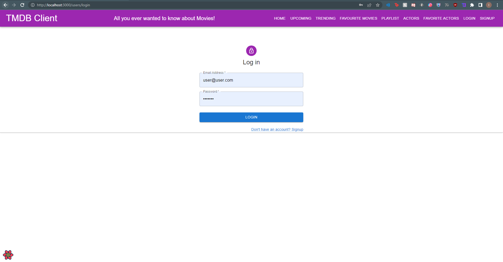
>Login Page taking in email and password. Log in will return to homepage logged in

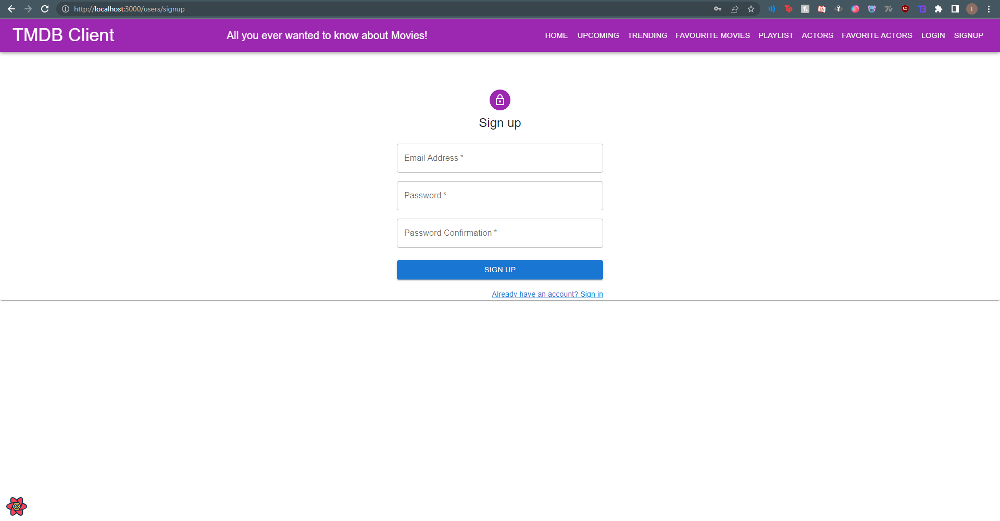

>Signup Page takes in email address and password and password confirmation. Signup button will return to home page logged in

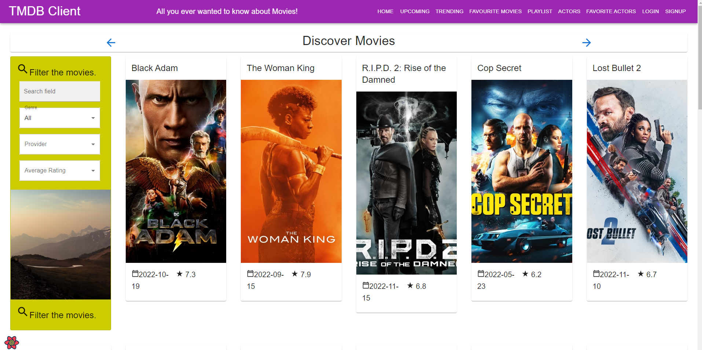

>DiscoverMovies/HomePage when user is not logged in. Clicking on FavouriteMovies,FavouriteActors and Playlist will navigate to log in first.

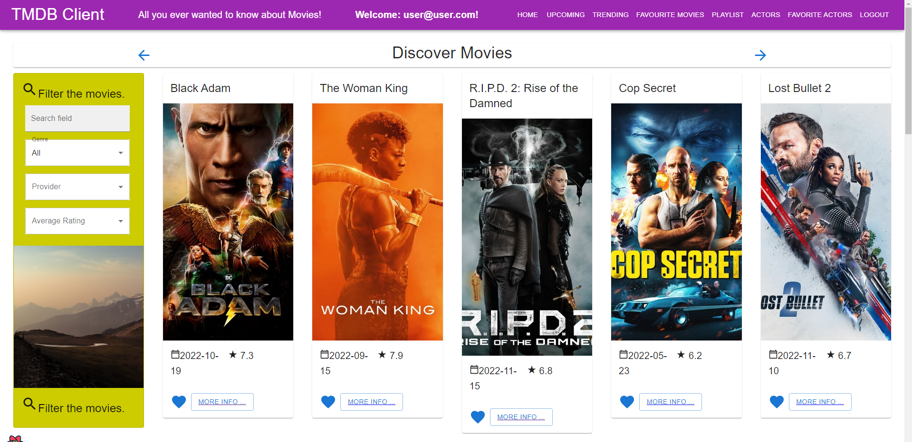

>DiscoverMovies/HomePage when user is logged in. Has access to movie details, actor Details, Adding to Favourites, Can add upcoming movies to mustWatch.

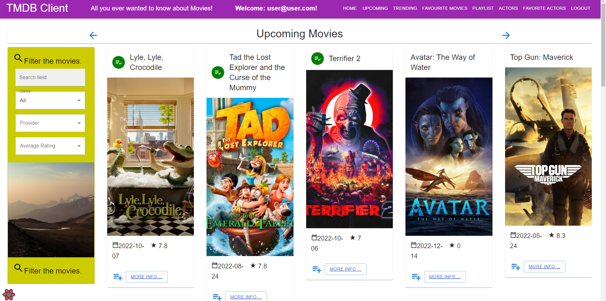

>Once logged in User can add upcoming movie to must Watch 

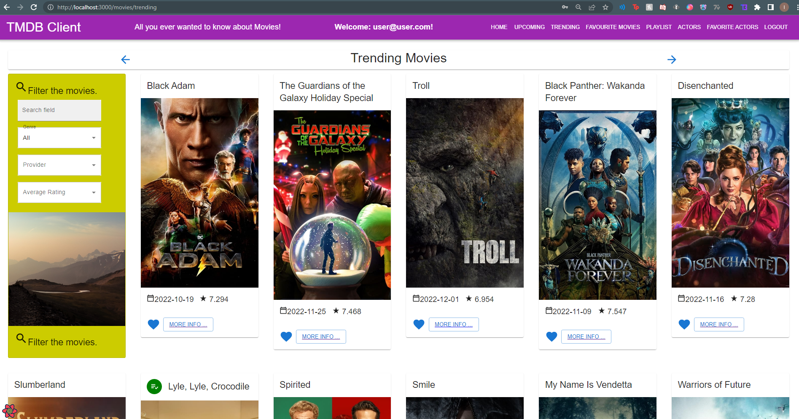

>Once logged in User can view trending movies by this week and add to favourites or more info

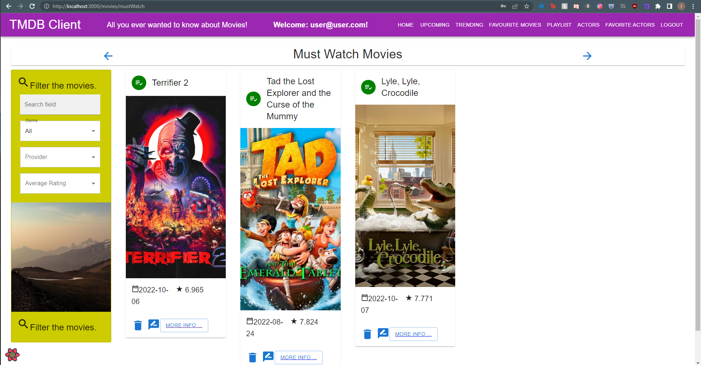

>Must Watch Page. User can remove, review or go to movie detail page

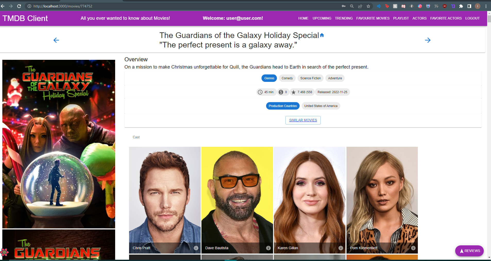

>Movie Details page added similar movies button and Cast members. Cast Members have more info button to bring to actors details

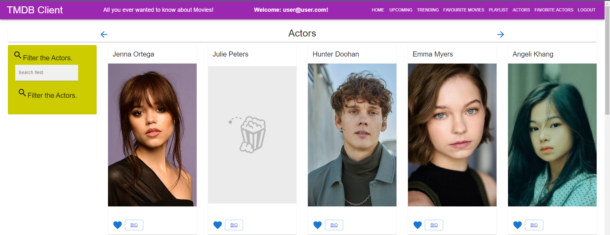

>List Page for Actors. Logged in users can add to favourites or Click Bio for actor Details Page

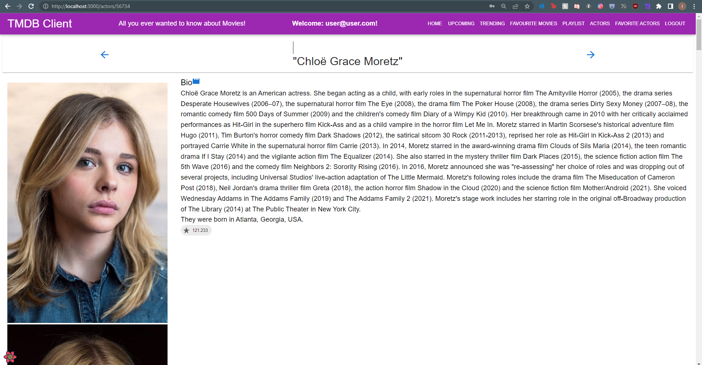

>Bio page for actors includes bio and popular rating chip, Button beside bio will direct to actors imdb page.

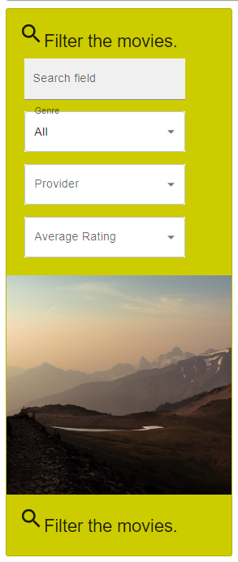

>Filter card allows for filtering by vote count average for that page. Watch Providers also implemented.
### Routing.

+ /actors (public) - displays a list of popular actors.
+ /movies/:id (private) - shows details about a particular movie.
+ /actors/:id (private) - shows details about a particular actor.
+ /actors/:id/movies (protected) - an actor's movie credits.
+ /movies/favourites (private) - (modified) displays list of favourite movies.
+ /actors/favourites (private) - displays a list of favourite actos
+ /movies/mustWatch (private) - displays a list of must watch movies
+ /users/signup (public) - signup page for authentication
+ /users/login (public) - login page for authentication
+ /movies/:id/similar (private) - shows a list of similar movies by selected movie

## Independent learning (If relevant).

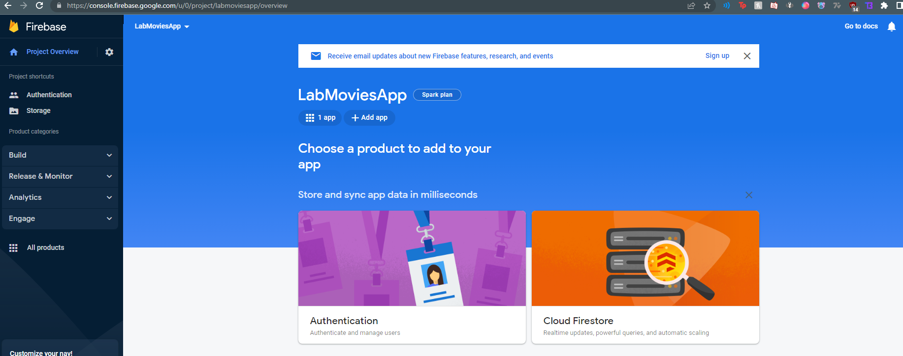
>Firebase Authentication 

## Refences for implementation of Firebase
+ [Firebase Documentation] (https://firebase.google.com/docs?gclid=CjwKCAiAksyNBhAPEiwAlDBeLFmJbo_e3-ogmR35UAUMkE9IIanL7VSwEQbkimCxlwelRP1Ae2hmqBoC1H8QAvD_BwE&gclsrc=aw.ds)

+ [Youtube video + PrivateRoutes] (https://www.youtube.com/watch?v=PKwu15ldZ7k)
+ [Blog Post] (https://blog.logrocket.com/user-authentication-firebase-react-apps/)

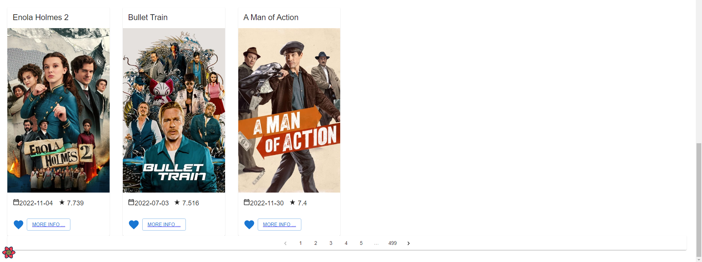

## References for implenting pagination
+ [Youtube video] (https://www.youtube.com/watch?v=IYCa1F-OWmk)
+ [mui documentation] (https://mui.com/material-ui/react-pagination/)
